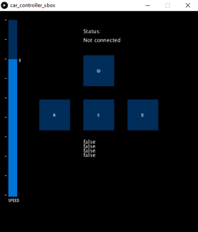

# EGEN-310 Control App
***NOTE: ALL CODE, EXCEPT FOR THE LIBRARIES IMPORTED WITHIN THE TWO .pde FILES AND the .ino FILE, WITH SOME REFERENCES AND RESEARCH OF COURSE***
## User Guide
---
### Preparation (Arduino Code)
1. To begin, install the Arduino IDE from [here.](https://www.arduino.cc/en/main/software) and also accept the install of any dependencies it may need.
2. Open the Arduino IDE.
3. File -> open -> arduino_controller.ino
4. Once open, plug in the arduino you plan to use for this project.
5. Once plugged in, the IDE should automatically detet what board you have plugged in.
6. Ensure that the HC-05 Bluetooth module is unplugged from the board.
7. Click the upload button in the upper left corner of the IDE to upload the code onto the controller board
8. Once completed move onto the processing code portion of the user guide.

### Preparation (Processing Code)
1. To begin, install the Processing 3 IDE from [here.](https://processing.org/download/) and also accept the install of any dependencies it may need.
2. Open the Processing 3 IDE.
3. File -> open -> car_controller.pde
4. Once open, ensure that the HC-05 bluetooth module has established a connection to the computer that you are using.
5. Click the play button in the upper left corner of the IDE.

### How to Use
1. At this point the app should have running smoothly. 
   - If an error message occurs saying that "Com port __ is busy", change  myPort = new Serial(this, Serial.list()[1], 9600); in line 25 to  myPort = new Serial(this, Serial.list()[0], 9600);
2. The car is then controlled via the WASD keys. 
    - W -> Forward
    - A -> Turn left using skid steer
    - S -> Reverse
    - D -> Turn right using skid steer
3. The speed of the motors can be controlled using the slider found on the left of the interface. Note: Speed values may vary depending on the type of servo used.

## Developer Guide (Arduino Code)
---
1. Follow the steps above to install and prepare your arduino for testing.
2. Once the steps above are completed, you are ready to begin developing great new additions to my app.
3. Comments can be found within the code that fully explain how each section of the code functions.
4. If the comments are insufficient, please read any and all documentation on the Arduino programming language

## Developer Guide (Processing)
---
1. Follow the steps above to install and prepare your Processing IDE for testing.
2. Once the steps above are completed, you are ready to begin developing great new additions to my app.
3. Comments can be found within the code that fully explain how each section of the code functions.
4. If the commments are insufficient, please see any and all documentation on Processing 3.

